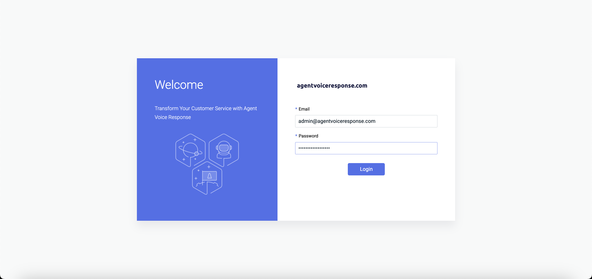
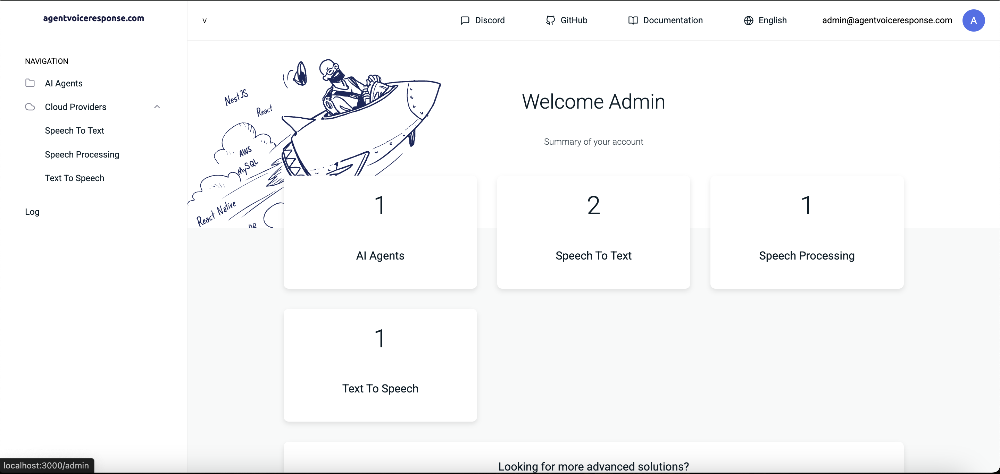

# AVR Infrastructure (avr-infra)

The **AVR Infrastructure** project is designed to launch the Agent Voice Response application, which will start the Core, ASR, LLM, and TTS services integrated with Asterisk Audiosocket. Additionally, the project runs a Docker Asterisk with a basic PJSIP configuration. To test, register a SIP client with username 1000 and password 1000 using TCP. The extensions will be generated once the AI Agent is configured from the application. The extension to call will be shown on the GUI.

## Project Overview

The infrastructure allows you to deploy the following services:

- **AVR Core**: Manages the interaction between the customer and the VoIP PBX (e.g., Asterisk), processing the audio stream and managing the integration with ASR, LLM, and TTS services.
- **ASR Services**: Converts voice to text. The infrastructure supports services like Google Cloud Speech-to-Text, Deepgram.
- **LLM Services**: Handles the logic and responses for customer interactions. For example, OpenAI, OpenRouter.ai, Typebot can be integrated to generate AI-based responses.
- **TTS Services**: Converts text responses into audio, allowing AVR Core to reply to the customer with speech. Services like Google Cloud Text-to-Speech, Deepgram, ElevenLabs are supported.

This architecture allows you to customize and swap ASR, LLM, and TTS providers as needed.

## Key Features

- **Modular Architecture**: Plug and play with any ASR, LLM, or TTS services via API.
- **Real-Time Audio Streaming**: Manages real-time interactions between customers and services.
- **Simple Configuration**: Set your ASR, LLM, and TTS providers by configuring environment variables.
- **Scalable Design**: Easy to extend and integrate with different services and AI providers.

## How It Works

### Flow Overview

1. **AVR Core** receives an audio stream from the Asterisk PBX.
2. The audio is sent to an **ASR** service to transcribe the speech to text.
3. The transcribed text is forwarded to an **LLM** service to generate an AI-powered response.
4. The generated response is sent to a **TTS** service to convert the text back to speech.
5. The speech is then played back to the customer through Asterisk.

## Setup Instructions

### Prerequisites

1. Docker and Docker Compose installed on your machine.
2. Google Cloud credentials if you are using their services for ASR or TTS.
3. OpenAI credentials if you are using their services for LLM.
4. Deepgram credentials if you are using their services for ASR or TTS.

### Clone the Repository

```bash
git clone https://github.com/agentvoiceresponse/avr-infra
cd avr-infra
```

### Configuration

Edit the `.env` file to set your environment variables for ASR, LLM, and TTS services:

```bash
NODE_ENV=production
APP_VERSION=1.0.0
PORT=3000

ADMIN_EMAIL=YOUR_EMAIL
ADMIN_PASSWORD=YOUR_PASSWORD

DATABASE_HOST=127.0.0.1
DATABASE_PORT=3306
DATABASE_NAME=avr-app
DATABASE_USERNAME=avr
DATABASE_PASSWORD=MYSQL_PASSWORD

DATABASE_ROOT_PASSWORD=MYSQL_ROOT_PASSWORD
```

### Run the Infrastructure

To start all services, simply run:

```bash
docker-compose up -d
```

This command will start Asterisk, MySQL, and the web application. To access the web application, go to `localhost:3000` (or the port configured in the `.env` file) and log in with the `ADMIN_EMAIL` and `ADMIN_PASSWORD` configured in the `.env` file.

### Enjoy the Agent Voice Response APP

Once you've set up the infrastructure, you can access the application through your browser. Begin by logging in with your credentials:



After logging in, you'll be directed to the dashboard where you can configure and manage your AI Agents, view call statistics, and monitor the system:



## Available Integrations

For a list of available integrations (ASR, LLM, TTS), visit our [GitHub Repositories](https://github.com/orgs/agentvoiceresponse/repositories).

## Contributions

For those who wish to contribute to the project, please send an email to [info@agentvoiceresponse.com](mailto:info@agentvoiceresponse.com).
